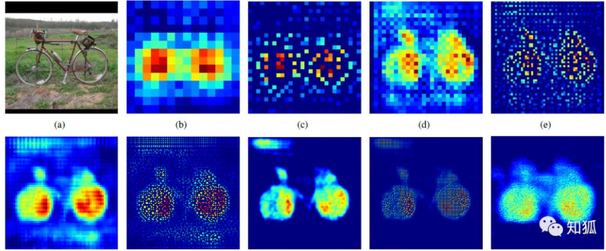
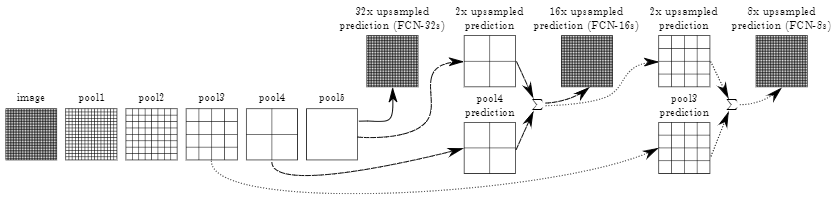

# Fully Convolutional Networks for Semantic Segmentation

### 关键问题
 - 解决了什么问题？
    - 建立全卷积网络，可接受任意大小的输入，解决图像语义分割问题。
 - 使用了什么方法？
    - 将目前的分类网络（AlexNet，VGG net和GoogLeNet）转变为完全卷积网络，并通过微调将其转移至分割任务。
    - 跳级("skip")结构，综合了不同深度的语义信息，提高分割的精度
    - 使用了转置卷积，对低分辨率的图像进行上采样，输出同分辨率的图像。
 - 效果如何？
    - 在PASCAL VOC数据集上，mean IU达到62.2%，较之前的方法提升了20%。
    - 时间减少了五分之一，每张图像处理时间约为0.2s。
 - 存在问题？
    - 因为模型是基于CNN改进而来，依然是独立像素进行分类，没有考虑到像素与像素之间的关系。
    - 分割结果不够精细，图像过于模糊或平滑，没有分割出目标图像的细节。

### CNN到FCN
以AlexNet为例，FCN将CNN的全连接层替换为卷积层。  

  

 - 为什么要将全连接层换为卷积层呢？
   - 如果卷积核的 kernel_size 和输入 feature maps 的 size 一样，那么相当于该卷积核计算了全部 feature maps 的信息，则相当于是一个 kernel_size∗1 的全连接。
   - 全连接的结构是固定的，当我们训练完时每个连接都是有权重的。而卷积过程我们其实为训练连接结构，学习了目标和那些像素之间有关系，权重较弱的像素我们可以忽略。
   - 全连接不会学习过滤，会给每个连接分权重并不会修改连接关系。卷积则是会学习有用的关系，没用得到关系它会弱化或者直接 dropout。这样卷积块可以共用一套权重，减少重复计算，还可以降低模型复杂度。
   
### 转置卷积

a 是输入图像，b 是经过卷积得到的特征图，分辨率明显下降。经过上采样（转置卷积）提升分辨率得到同时，还保证了特征所在区域的权重，最后将图片的分辨率提升原图一致后，权重高的区域则为目标所在区域。

FCN 模型处理过程也是这样，通过卷积和转置卷积我们基本能定位到目标区域，但是，我们会发现模型前期是通过卷积、池化、非线性激活函数等作用输出了特征权重图像，我们经过反卷积等操作输出的图像实际是很粗糙的，毕竟丢了很多细节。因此我们需要找到一种方式填补丢失的细节数据，所以就有了跳跃结构。

### Skip结构
  

 - FCN-32s
    - 从特征小图（16*16*4096）预测分割小图（16*16*21），之后直接升采样为大图。转置卷积的步长为32，这个网络称为FCN-32s。
 - FCN-16s
    - 升采样分为两次完成。在第二次升采样前，把第4个pooling层的预测结果融合进来。使用跳级结构提升精确性。第二次转置卷积步长为16，这个网络称为FCN-16s。
 - FCN-8s
    - 升采样分为三次完成。进一步融合了第3个pooling层的预测结果。第三次反卷积步长为8，记为FCN-8s。 

  
较浅层的预测结果包含了更多细节信息。比较2,3,4阶段可以看出，跳级结构利用浅层信息辅助逐步升采样，有更精细的结果。 

### FCN实现
