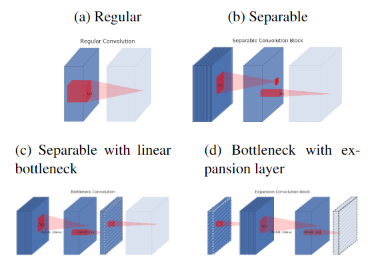
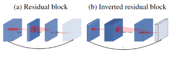
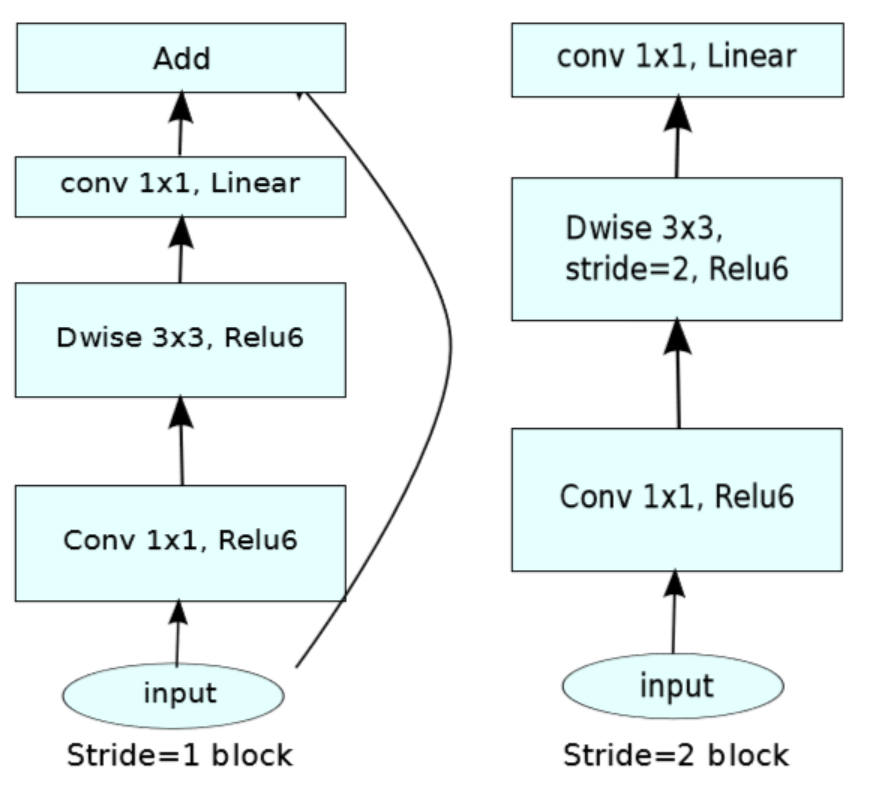

# MobileNetV2: Inverted Residuals and Linear Bottlenecks

### 关键问题
 - 解决了什么问题？
    - MobileNetV1网络是一条路的单通道结构，没有feature map的复用。ResNet和DenseNet等网络的提出，也验证了feature map复用对提升网络性能的有效性，MobileNetV2便应运而生。
 - 使用了什么方法？
    - 具有线性瓶颈的反向残差结构(theinverted residual with linear bottleneck.)
 - 效果如何？
    - mIOU 75.32% Params 2.11M MAdds 2.75B
    
### Linear Bottlenecks
  

 - 流形相关
    - 高维空间有冗余，低维空间没冗余。也就是说，流形可以作为一种数据降维的方式。
    - 能够刻画数据的本质。也就是说，既然学习到了”将数据从高维空间降维到低维空间，还能不损失信息”的映射，那这个映射能够输入原始数据，输出数据更本质的特征(就像压缩一样，用更少的数据尽可能地表示原始数据)。
 - 假设某层的输出的feature map大小为HxWxD，经过激活层后称之为manifold of interest，可以理解为感兴趣流形或有用的信息，大小仍为HxWxD，经验证明manifold of interest完全可以压缩到低维子空间，在V1版本中便可以通过width multiplier parameter来降低激活空间的维数使得manifold of interest充满整个空间。
 - 在使用ReLU函数进行激活时，负数直接变为0，这样就会导致失去较多有用的信息  
 - 总结
    - 如果manifold of interest经过ReLU后均为非零，意味着只经过了一个线性变换
    - 除非input manifold位于输入空间的低维子空间，经过ReLU后才能保持完整的信息
    - 因此使用linear bottleneck来解决由于非线性激活函数造成的信息损失问题。linear bottleneck本质上是不带ReLU的1x1的卷积层。
    
### Inverted Residuals
  

  

在Inverted residual 结构中，bottleneck放在了首尾，中间则通过expand来扩展了channel。
具体的Inverted residual的结构参见下图，input首先经过expand layer，channel扩展为原来的6倍，然后再经过depthwise convolution layer和linear layer，恢复为原来的大小。在depthwise convolution layer首先将channel扩展，增加了冗余，以便后边的Depthwise Separable Convolutions能够选择到包含manifold of interest的channel。

ReLU6在低精度计算时具有鲁棒性。

### 语义分割实验
 - 三种设计变体
    - 不同的特征提取
    - 简化DeepLabv3
    - 不同的推理策略
 - 结论
    - 推理策略（包括多尺度输入和添加左右翻转图像）显着增加了MAdds，因此不适合在设备上应用。
    - outputstride = 16比outputstride = 8效率更高
    - MobileNetV1已经是功能强大的功能提取器，与ResNet-101 [8]相比，只需要MAdds减少大约4.9-5.7倍（例如，mIOU：78.56vs82.70，而MAdds：941.9Bvs4870.6B
    - DeepLabv3 head在计算上很昂贵，删除ASPP模块会显着降低MAdds，而性能只会略有下降
    
### 如何获得轻量级网络
 - 改变内部卷积块的结构
 - 超参数优化
 - 网络剪枝
 - 连接性学习
 - 遗传算法
 - 强化学习
    
    
