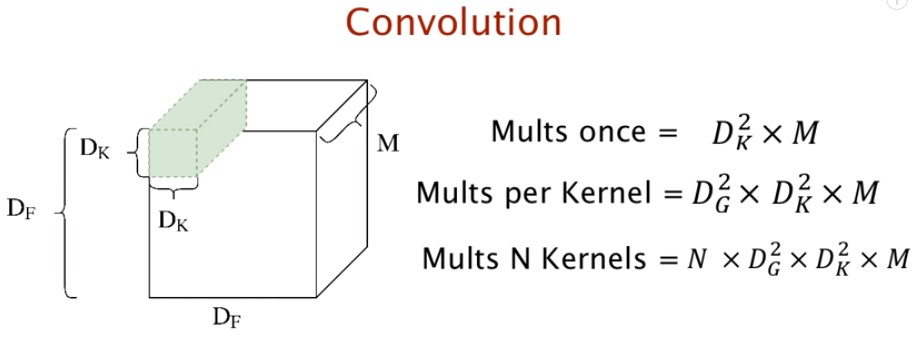
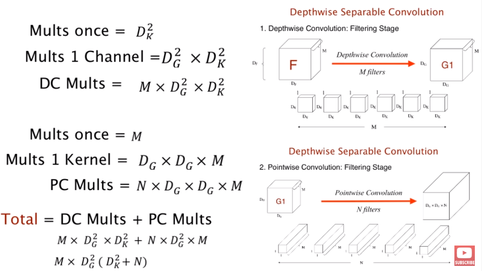
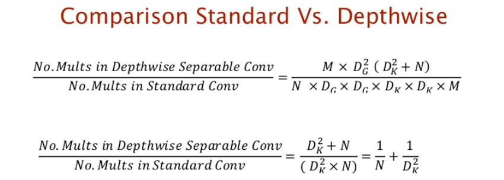
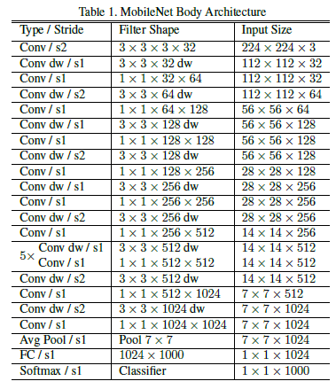

# MobileNets: Efficient Convolutional Neural Networks for Mobile Vision Applications

### 关键问题
 - 解决了什么问题？
    - 为了提高精度，现有的卷积神经网络变得越来越复杂，从网络的尺寸和速度来讲，这些设计并不是必要的。在实际应用中，比如自动驾驶、人机交互、增强现实等计算量有限的平台需要更轻量的卷积神经网络。
 - 使用了什么方法？
    - 深度可分离卷积(depthwise separable convolution)
    - 全局超参数(width multiplier&resolution multiplier)
 - 效果如何？
    - 在ImageNet上达到了70.6%的准确率，相比于Conv MobileNet值降低了10%左右。
 - 存在问题？
    - 在轻量级与速度的基础上，准确率有待提高。
    
### Depthwise separable convolution
 - Depthwise separable convolution = depthwise conv + pointwise conv  
 
   
 
   
  
   
 
 - 减少了计算次数及参数
 
### 全局超参数
 - 宽度乘数 α：为了构建更小和更少计算量的网络，作者引入了宽度乘数α ，作用是改变输入输出通道数，减少特征图数量，让网络变瘦。其中，α 取值是0~1，应用宽度乘数可以进一步减少计算量，大约有 α^2 的优化空间。
 - 分辨率乘数ρ:分辨率乘数用来改变输入数据层的分辨率，同样也能减少参数。
### 网络结构
     
 
MobileNets结构建立在上述深度可分解卷积中（只有第一层是标准卷积）。该网络允许算法探索网络拓扑，找到一个适合的良好网络。除了最后的全连接层，所有层后面跟了batchnorm和ReLU，最终输入到softmax进行分类。
 
### 训练策略
 - RMSprop
 - less regularization and data augmentation(小网络难以过拟合)
 
