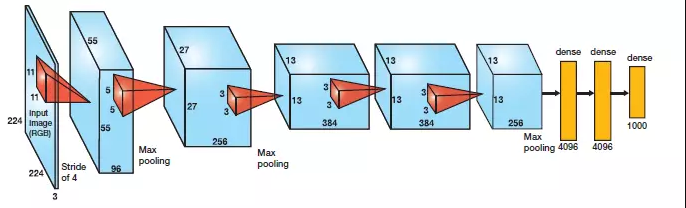
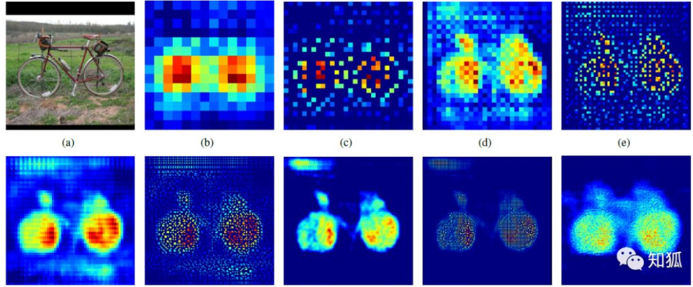
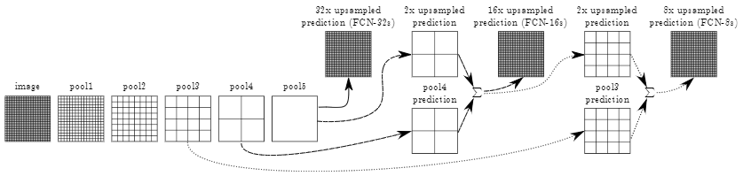
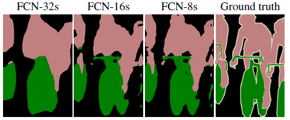
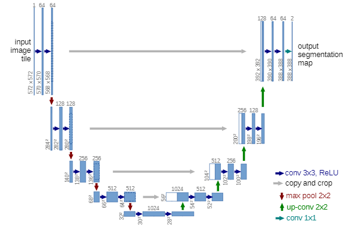
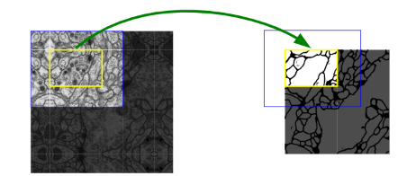
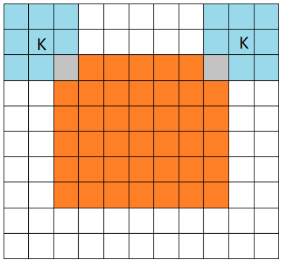
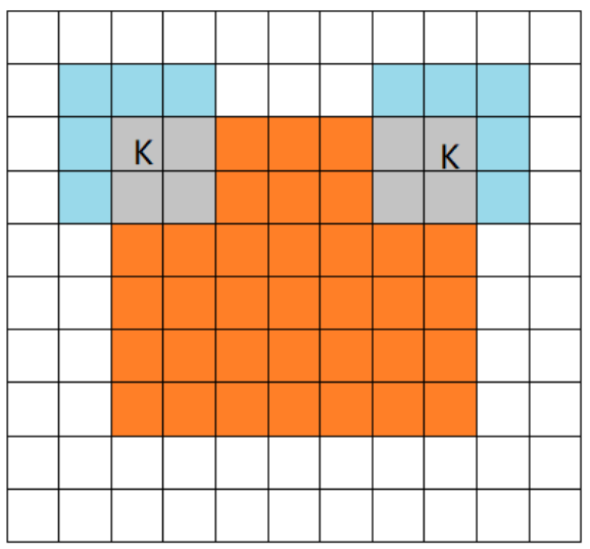
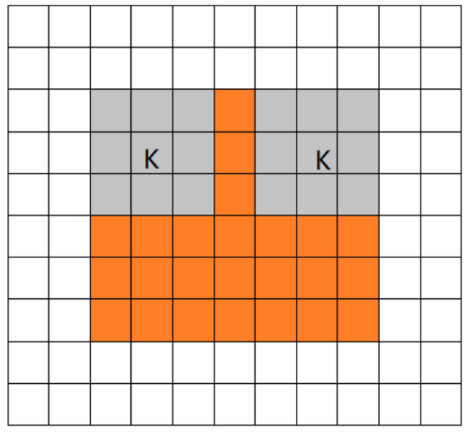

# Semantic-Segmentation

### Paper Reading
 - FCN Fully Convolutional Networks for Semantic Segmentation
 - U-Net: Convolutional Networks for BiomedicalImage Segmentation  
   
   

## FCN
### 关键问题
 - 解决了什么问题？
    - 建立全卷积网络，可接受任意大小的输入，解决图像语义分割问题。
 - 使用了什么方法？
    - 将目前的分类网络（AlexNet，VGG net和GoogLeNet）转变为完全卷积网络，并通过微调将其转移至分割任务。
    - 跳级("skip")结构，综合了不同深度的语义信息，提高分割的精度
    - 使用了转置卷积，对低分辨率的图像进行上采样，输出同分辨率的图像。
 - 效果如何？
    - 在PASCAL VOC数据集上，mean IU达到62.2%，较之前的方法提升了20%。
    - 时间减少了五分之一，每张图像处理时间约为0.2s。
 - 存在问题？
    - 因为模型是基于CNN改进而来，依然是独立像素进行分类，没有考虑到像素与像素之间的关系。
    - 分割结果不够精细，图像过于模糊或平滑，没有分割出目标图像的细节。

### CNN到FCN
以AlexNet为例，FCN将CNN的全连接层替换为卷积层。  

  

 - 为什么要将全连接层换为卷积层呢？
   - 如果卷积核的 kernel_size 和输入 feature maps 的 size 一样，那么相当于该卷积核计算了全部 feature maps 的信息，则相当于是一个 kernel_size∗1 的全连接。
   - 全连接的结构是固定的，当我们训练完时每个连接都是有权重的。而卷积过程我们其实为训练连接结构，学习了目标和那些像素之间有关系，权重较弱的像素我们可以忽略。
   - 全连接不会学习过滤，会给每个连接分权重并不会修改连接关系。卷积则是会学习有用的关系，没用得到关系它会弱化或者直接 dropout。这样卷积块可以共用一套权重，减少重复计算，还可以降低模型复杂度。
   
### 转置卷积
  

a 是输入图像，b 是经过卷积得到的特征图，分辨率明显下降。经过上采样（转置卷积）提升分辨率得到同时，还保证了特征所在区域的权重，最后将图片的分辨率提升原图一致后，权重高的区域则为目标所在区域。

FCN 模型处理过程也是这样，通过卷积和转置卷积我们基本能定位到目标区域，但是，我们会发现模型前期是通过卷积、池化、非线性激活函数等作用输出了特征权重图像，我们经过反卷积等操作输出的图像实际是很粗糙的，毕竟丢了很多细节。因此我们需要找到一种方式填补丢失的细节数据，所以就有了跳跃结构。

### Skip结构
  

 - FCN-32s
    - 从特征小图（16*16*4096）预测分割小图（16*16*21），之后直接升采样为大图。转置卷积的步长为32，这个网络称为FCN-32s。
 - FCN-16s
    - 升采样分为两次完成。在第二次升采样前，把第4个pooling层的预测结果融合进来。使用跳级结构提升精确性。第二次转置卷积步长为16，这个网络称为FCN-16s。
 - FCN-8s
    - 升采样分为三次完成。进一步融合了第3个pooling层的预测结果。第三次反卷积步长为8，记为FCN-8s。 

  
较浅层的预测结果包含了更多细节信息。比较2,3,4阶段可以看出，跳级结构利用浅层信息辅助逐步升采样，有更精细的结果。 

## U-Net

### 关键问题
 - 解决了什么问题？
    - 提出一种网络结构和训练策略，能够适应很小的训练集。并且适合超大图像分割，适合医学图像分割。
 - 使用了什么方法？
    - 编码器-解码器结构。编码器逐渐减少池化层的空间维度，解码器逐步修复物体的细节和空间维度。编码器和解码器之间通常存在快捷连接，因此能帮助解码器更好地修复目标的细节。

### 网络结构
  
 - 在上图中，每一个蓝色块表示一个多通道特征图，特征图的通道数标记在顶部，X-Y尺寸设置在块的左下边缘。不同颜色的箭头代表不同的操作。图的左半部分是收缩路径，右半部分是扩展路径。
 - 网络对于输入的大小也是有要求的。为了使得输出的分割图无缝拼接，重要的是选择输入块的大小，以便所有的2 X 2的池化层都可以应用于偶数的 x 层和 y 层。一个比较好的方法是从最下的分辨率从反向推到，比如说在网络结构中，最小的是32 X 32，沿着收缩路径的反向进行推导可知，输入图像的尺寸应该为572×572。
 - 其中需要注意的是，每经过一次上采样都会将通道数减半，再与收缩路径对应的特征图进行拼接。在拼接之前进行 crop 是必要的(例如在上图中，6464大与5656，为了使这两个特征图能够顺利拼接，取6464中间部分5454的大小，然后拼接)，因为两者的尺寸并不相同（主要是因为 valid conv 造成的）。最后一层使用1 X 1大小的卷积核，将通道数降低至特定的数量（如像素点的类别数量）。
 
### U-Net与FCN的区别
U-net与FCN的不同在于，U-net的上采样依然有大量的通道，这使得网络将上下文信息向更高层分辨率传播，作为结果，扩展路径与收缩路径对称，形成一个U型的形状（如上图所示）。 网络没有全连接层并且只是用每一个卷积层的有效部分。

### Overlap-tile
  
 - 上图是针对任意大小的输入图像的无缝分割的 Overlap-tile 策略。如果我们要预测黄色框内区域（即对黄色的内的细胞进行分割，获取它们的边缘），需要将蓝色框内部分作为输入，如果黄色区域在输入图像的边缘的话，那么缺失的数据使用镜像进行补充。如上图左边图像所示，输入图像周围一圈都进行了镜像补充。
 - 因为进行的是valid卷积，即上下文只取有效部分，可以理解为padding为0，卷积之后的图像尺寸会改变，所以需要取比黄色框大的图像来保证上下文的信息是有意义的，缺失的部分用镜像的方法补充是填充上下文信息最好的方法了。这种方法通常需要将图像进行分块的时候才使用。
 - 那么为什么要对图像分块，不输入整张图像呢？因为内存限制，有的机器内存比较小，需要分块输入。但比之前的滑窗取块要好很多，一方面不用取那么多块，另一方面块之间也没有那么大的区域重叠。通过Overlap-tile 策略可以将图像分块输入，否则的话就只能对图像进行 resize 了，但是这样会降低输入图像的分辨率。
 
### 卷积的三种模式:full, same, valid
三种不同模式是对卷积核移动范围的不同限制。  
 - full conv

   

橙色部分为image, 蓝色部分为filter。full模式的意思是，从filter和image刚相交开始做卷积，白色部分为填0。filter的运动范围如图所示。  

 - same conv  
 
    

当filter的中心(K)与image的边角重合时，开始做卷积运算，可见filter的运动范围比full模式小了一圈。注意：这里的same还有一个意思，卷积之后输出的feature map尺寸保持不变(相对于输入图片)。当然，same模式不代表完全输入输出尺寸一样，也跟卷积核的步长有关系。same模式也是最常见的模式，因为这种模式可以在前向传播的过程中让特征图的大小保持不变，调参师不需要精准计算其尺寸变化(因为尺寸根本就没变化)。  

 - valid conv  
 
   
 
 当filter全部在image里面的时候，进行卷积运算，可见filter的移动范围较same更小了。
